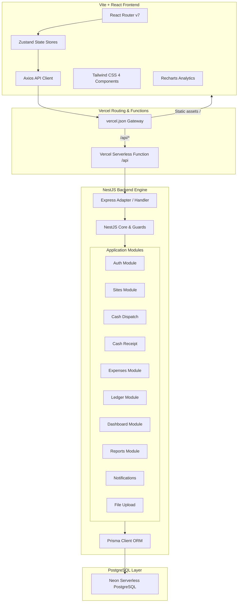
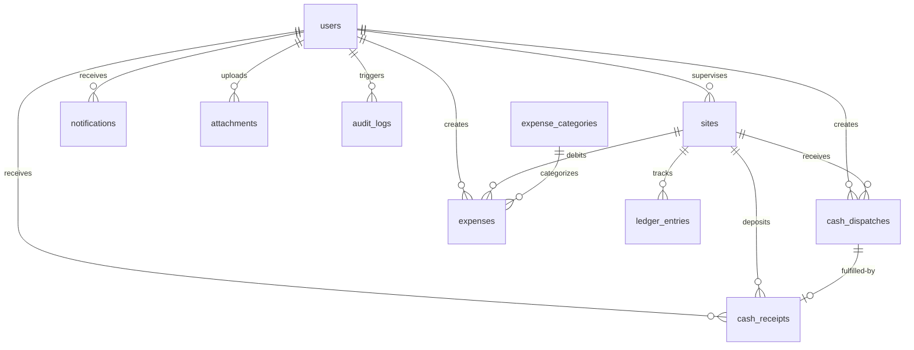

# Cashflow Management System - Technical Architecture & Documentation

This document serves as the comprehensive technical reference for the **Cashflow Management System**, a high-fidelity web application designed to track cash disbursements, field-level expenses, and ledger entries for multi-site construction and project environments.

---

## 🗺️ Architectural Overview

The Cashflow Management System is built as a highly optimized monorepo, leveraging a serverless-ready architecture. It integrates a **NestJS** backend framework with a **Vite + React 19** frontend, deployed as a unified project on Vercel.



---

## 💻 Technical Stack

### Core Technologies

| Layer | Technology | Primary Purpose | Key Features Utilized |
| :--- | :--- | :--- | :--- |
| **Monorepo** | npm Workspaces | Dependency isolation & centralized control | Root package script triggers both client & server builders |
| **Backend** | NestJS | Enterprise-grade modular API engine | Dependency injection, controllers, guards, filters, interceptors |
| **Database ORM** | Prisma Client | Type-safe database queries & migrations | Automated schema-to-client generation, relational joins |
| **Database Engine**| PostgreSQL (Neon) | Relational persistence | Atomic transactions, decimal precision formatting |
| **Frontend** | React 19 + Vite | Fast, interactive single-page application | Hot Module Replacement (HMR), component-driven views |
| **Styling** | Tailwind CSS 4 | Visual design & glassmorphism | `@tailwindcss/vite` integration, native theme customization |
| **State Mgmt** | Zustand | Centralized reactive client-side store | Lightweight, persistent hooks for Auth and Notifications |
| **Http Client** | Axios | Backend endpoint communication | Authorization interceptors, global error/401 handling |
| **Analytics** | Recharts | Visual charts & reporting dashboards | Responsive container, HSL tailored bar and area charts |

---

## 🗄️ Database Schema & Relational Design

The system employs a strict double-entry ledger design to ensure financial audits remain consistent. All currency transactions utilize `Decimal` precision types to prevent rounding errors associated with floats.



### Database Tables Detail

#### 1. `User` (`users`)
Stores credentials and authorization credentials. Users can act as system administrators/owners or field-level site supervisors.
*   **Fields**:
    *   `id` (`String`, UUID, Primary Key)
    *   `email` (`String`, Unique) - Primary login handle.
    *   `name` (`String`) - User's display name.
    *   `password` (`String`) - Bcrypt-hashed password.
    *   `phone` (`String`, Optional) - Contact phone.
    *   `role` (`Role`: `OWNER` | `SUPERVISOR`) - Controls API endpoints accessibility.
    *   `isActive` (`Boolean`, Default `true`) - Toggles user account status.
    *   `createdAt` & `updatedAt` (`DateTime`)
*   **Relations**:
    *   Supervises multiple `sites`.
    *   Triggers/creates multiple dispatches, receipts, expenses, audit logs, notifications, and attachments.

#### 2. `Site` (`sites`)
Defines construction/project locations. Each active site carries a cash balance.
*   **Fields**:
    *   `id` (`String`, UUID, Primary Key)
    *   `code` (`String`, Unique) - short human-readable identifier (e.g. `SITE-A`).
    *   `name` (`String`) - Descriptive location name.
    *   `location` (`String`) - Physical geographic address.
    *   `status` (`SiteStatus`: `ACTIVE` | `INACTIVE`)
    *   `currentBalance` (`Decimal(15, 2)`, Default `0`) - Current cash on site.
    *   `supervisorId` (`String`, Optional, Nullable) - References `User.id`.
*   **Relations**:
    *   `supervisor`: References `User` supervising the site.
    *   Logs multiple ledger entries, dispatches, receipts, and expenses.
*   **Indexes**:
    *   Index on `supervisorId` (optimal querying for dashboard stats).
    *   Index on `status`.

#### 3. `CashDispatch` (`cash_dispatches`)
Represents cash shipments dispatched from the central office (Owner) to a specific construction site.
*   **Fields**:
    *   `id` (`String`, UUID, Primary Key)
    *   `siteId` (`String`) - References `Site.id`.
    *   `amount` (`Decimal(15, 2)`) - Cash amount sent.
    *   `carrierName` (`String`) - Driver/carrier transporting cash.
    *   `purpose` (`String`) - Intended usage description.
    *   `notes` (`String`, Optional)
    *   `dispatchDate` (`DateTime`)
    *   `status` (`DispatchStatus`: `PENDING_RECEIPT`, `RECEIVED`, `PARTIAL_RECEIVED`, `DISPUTED`)
    *   `createdById` (`String`) - References `User.id` (creator).
*   **Relations**:
    *   `site`: Targeted site.
    *   `createdBy`: Owner who issued dispatch.
    *   `receipt`: Link to corresponding receipt (1-to-1).
*   **Indexes**:
    *   Composite index on `[siteId, status]` (fetches outstanding cash details).
    *   Index on `createdById`.

#### 4. `CashReceipt` (`cash_receipts`)
Field confirmation logged by a Supervisor when a cash dispatch reaches a site.
*   **Fields**:
    *   `id` (`String`, UUID, Primary Key)
    *   `dispatchId` (`String`, Unique) - 1-to-1 link to `CashDispatch.id`.
    *   `siteId` (`String`) - References `Site.id`.
    *   `receivedAmount` (`Decimal(15, 2)`) - Actual amount verified by supervisor.
    *   `discrepancyAmount` (`Decimal(15, 2)`, Default `0`) - Automated delta if `receivedAmount != dispatchedAmount`.
    *   `remarks` (`String`, Optional) - Notes explaining discrepancies.
    *   `receivedById` (`String`) - References `User.id`.
    *   `receivedAt` (`DateTime`, Default `now()`)
*   **Relations**:
    *   `dispatch`, `site`, `receivedBy` references.

#### 5. `Expense` (`expenses`)
Project-related payments logged by field supervisors. Must undergo review by the owner.
*   **Fields**:
    *   `id` (`String`, UUID, Primary Key)
    *   `siteId` (`String`) - References `Site.id`.
    *   `categoryId` (`String`) - References `ExpenseCategory.id`.
    *   `amount` (`Decimal(15, 2)`) - Price paid.
    *   `vendorName` (`String`) - Party receiving cash.
    *   `description` (`String`, Optional)
    *   `expenseDate` (`DateTime`)
    *   `status` (`ExpenseStatus`: `PENDING`, `APPROVED`, `REJECTED`)
    *   `createdById` (`String`) - References `User.id`.
*   **Relations**:
    *   `site`, `category`, `createdBy` references.
    *   `attachments`: List of receipt images or PDF invoices.
*   **Indexes**:
    *   Composite index on `[siteId, expenseDate]` (powers monthly reports).
    *   Index on `categoryId`, `createdById`.

#### 6. `ExpenseCategory` (`expense_categories`)
Taxonomic groupings for expenses (e.g., `Materials`, `Labor`, `Utilities`, `Logistics`).
*   **Fields**:
    *   `id` (`String`, UUID, Primary Key)
    *   `name` (`String`, Unique)
    *   `description` (`String`, Optional)

#### 7. `LedgerEntry` (`ledger_entries`)
Immutable transaction audit history reflecting any action modifying a Site's balance.
*   **Fields**:
    *   `id` (`String`, UUID, Primary Key)
    *   `siteId` (`String`) - References `Site.id`.
    *   `transactionType` (`TransactionType`: `CASH_RECEIVED` | `EXPENSE` | `ADJUSTMENT`)
    *   `referenceType` (`String`) - Tracks source model (e.g. `CashReceipt`, `Expense`).
    *   `referenceId` (`String`) - ID of the source transaction.
    *   `credit` (`Decimal(15, 2)`, Default `0`) - Added to balance.
    *   `debit` (`Decimal(15, 2)`, Default `0`) - Subtracted from balance.
    *   `balanceAfter` (`Decimal(15, 2)`) - Resulting site balance.
    *   `description` (`String`, Optional)
    *   `createdAt` (`DateTime`, Default `now()`)
*   **Indexes**:
    *   Composite index on `[siteId, createdAt]` (optimized ledger statement sort).
    *   Composite index on `[referenceType, referenceId]` (quick lookup of audits).

#### 8. `Notification` (`notifications`)
In-app notification system notifying actors of changes.
*   **Fields**:
    *   `id` (`String`, UUID, Primary Key)
    *   `userId` (`String`) - Recipient user.
    *   `title` & `message` (`String`)
    *   `type` (`NotificationType`: `DISPATCH_CREATED`, `RECEIPT_PENDING`, `RECEIPT_CONFIRMED`, `LOW_BALANCE`, `EXPENSE_ADDED`, `EXPENSE_APPROVED`, `EXPENSE_REJECTED`)
    *   `isRead` (`Boolean`, Default `false`)
    *   `referenceType` & `referenceId` (`String`, Optional) - Links notification to entity details page.
*   **Indexes**:
    *   Composite index on `[userId, isRead]`, `[userId, createdAt]`.

#### 9. `Attachment` (`attachments`)
Upload metadata linking files to transactions.
*   **Fields**:
    *   `id` (`String`, UUID, Primary Key)
    *   `fileName` & `originalName` (`String`)
    *   `filePath` (`String`) - Base64 Data URL payload (supports database-only storage on serverless deployments).
    *   `mimeType` (`String`)
    *   `size` (`Int`)
    *   `referenceType` & `referenceId` (`String`) - Association mapping (e.g. linked to `Expense`).
    *   `uploadedById` (`String`) - Uploader user.

#### 10. `AuditLog` (`audit_logs`)
System compliance logging. Tracks all modifications.
*   **Fields**:
    *   `id` (`String`, UUID, Primary Key)
    *   `userId` (`String`, Optional) - Active actor.
    *   `action` (`String`) - e.g. `UPDATE_SITE`, `APPROVE_EXPENSE`.
    *   `entity` (`String`) - target model (e.g. `Site`).
    *   `entityId` (`String`, Optional)
    *   `oldValue` & `newValue` (`String`, Text, Optional) - JSON representation of changes.
    *   `ipAddress` (`String`, Optional)
    *   `createdAt` (`DateTime`)

---

## ⚙️ Backend Architecture

The backend is built around a NestJS framework in a modular pattern. Every functional block contains its own Module, Controller, Service, and relevant DTOs.

```
server/src/
├── main.ts                       # Entrypoint bootstrapping the NestJS application
├── app.module.ts                 # Main module importing and organizing all submodules
├── prisma/                       # Database Prisma service provider
│   ├── prisma.module.ts
│   └── prisma.service.ts
├── common/                       # Centralized utilities shared across modules
│   ├── decorators/               # Custom request parsers (@CurrentUser, @Roles)
│   ├── filters/                  # Error translators (http-exception.filter.ts)
│   ├── guards/                   # Route protection (jwt-auth.guard.ts, roles.guard.ts)
│   ├── interceptors/             # Response layout formatting wrapper (response.interceptor.ts)
│   └── dto/                      # Shared pagination DTOs
└── modules/                      # Modular application sub-components
    ├── auth/                     # JWT authentication, hashing, and token issuance
    ├── sites/                    # Construction site management
    ├── cash-dispatch/            # Cash delivery tracking
    ├── cash-receipt/             # Field receipt confirmations
    ├── expenses/                 # Cash expense reports and approvals
    ├── ledger/                   # Site transaction registers
    ├── dashboard/                # Aggregations for supervisor/owner stats
    ├── reports/                  # Chart aggregations and breakdowns
    ├── notifications/            # In-app message hub
    ├── users/                    # System user profiles management
    └── file-upload/              # Base64 in-memory file processing
```

### Core Architecture Features

1.  **JWT Verification and Guards**:
    *   `JwtAuthGuard` checks the presence of a valid `Bearer <token>` in incoming requests.
    *   `RolesGuard` extracts the user's role and verifies it against metadata defined via the custom `@Roles(Role.OWNER)` decorator, implementing Role-Based Access Control (RBAC).
2.  **Validation and Pipes**:
    *   NestJS `ValidationPipe` parses and sanitizes request bodies globally, ensuring payload schemas match validation decorators (e.g. `@IsString()`, `@IsDecimal()`, `@Min()`) via `class-validator`.
3.  **Response Format Standardizer**:
    *   A global `ResponseInterceptor` formats all outbound payloads into a standard JSON envelop: `{ success: true, data: T }`.
    *   A global `HttpExceptionFilter` catches errors and outputs a normalized envelope: `{ success: false, message: string, statusCode: number }`.
4.  **Serverless In-Memory Upload Strategy**:
    *   Vercel serverless environments enforce read-only filesystems.
    *   `FileUploadController` solves this by handling uploads via a `MemoryStorage` buffer under Multer.
    *   Uploaded image or PDF buffers are converted directly into Base64 Data URL strings (`data:image/png;base64,...`) and returned to the client to be saved directly in the PostgreSQL database. This removes the need for configuring S3 or file-persistence disks.

---

## 🎨 Client (Frontend) Architecture

The React frontend utilizes a responsive, double-sidebar navigation flow. The interface switches between a sleek, amber-themed light theme and a dark mode designed using glassmorphic styling tokens.

```
client/src/
├── main.tsx                      # Frontend entrypoint
├── App.tsx                       # React Router configuration with ProtectedRoute layers
├── App.css / index.css           # Custom CSS, Tailwind 4 configs, and gradient styles
├── lib/
│   └── api.ts                    # Customized Axios client with interceptors
├── types/
│   └── index.ts                  # Shared TypeScript interfaces for models & stats
├── stores/                       # Zustand global stores
│   ├── auth-store.ts             # Auth tokens, credentials, and token refresh
│   └── notification-store.ts     # Unread counters and notifications list
├── components/
│   ├── layout/
│   │   └── app-layout.tsx        # Responsive main structure with dark/light mode toggle
│   └── shared/
│       └── protected-route.tsx   # Role-based route filter
└── pages/                        # Component pages mapped to router endpoints
    ├── login.tsx                 # Unified login interface
    ├── owner/                    # Owner dashboard and administrative views
    └── supervisor/               # Supervisor site dashboard and submission screens
```

### Core Client Mechanics

1.  **Axios API Client interceptors (`api.ts`)**:
    *   **Request Interceptor**: Extracts the stored `cashflow_token` from local storage and appends it as `Authorization: Bearer <token>` to every request automatically.
    *   **Response Interceptor**: Flattens NestJS envelopes, returning the raw `.data` payload for easier consumption.
    *   **Expired Token Auto-Logout**: Intercepts `401 Unauthorized` responses and automatically purges expired local storage tokens, redirecting the browser back to `/login` smoothly.
2.  **Zustand Auth Store Syncing**:
    *   `useAuthStore` manages user profiles.
    *   On start, it parses local storage credentials for immediate paint. It then performs a background `GET /auth/me` call to refresh user details. If token validation fails, it clears state instantly.
3.  **Theme Sync Control**:
    *   Maintains user preferences inside `localStorage.theme`.
    *   Toggles the class `dark` on `document.documentElement` to trigger Tailwind 4's dark-mode styles.
4.  **Background Updates Polling**:
    *   `AppLayout` boots a global 15-second background interval polling thread.
    *   This background thread refreshes the unread notification badge count (`fetchUnreadCount()`) and fires a custom event `dashboard_update` to let active dashboards reload visual elements silently.

---

## 🔌 API Endpoint Reference & Role Access

Every API route is mapped out below including permission parameters.

### 🔑 Authentication Module
| Endpoint | Method | Role Allowed | Description |
| :--- | :--- | :--- | :--- |
| `/api/auth/login` | `POST` | Public | Authenticates credentials and returns a JWT token + User details |
| `/api/auth/me` | `GET` | Authenticated | Validates session token and returns fresh User profile data |

### 🏢 Sites Module
| Endpoint | Method | Role Allowed | Description |
| :--- | :--- | :--- | :--- |
| `/api/sites` | `GET` | Authenticated | Lists sites. Supervisors only see their own assigned locations. Paginated. |
| `/api/sites/:id` | `GET` | Authenticated | Retrieves comprehensive profile details of a single site |
| `/api/sites/:id/summary`| `GET` | Authenticated | Gathers cumulative statistics (Cash received, Spent, counts) |
| `/api/sites` | `POST` | `OWNER` | Creates a new construction site |
| `/api/sites/:id` | `PATCH`| `OWNER` | Modifies site parameters (Status, Assigns supervisor, name) |

### 💸 Cash Dispatch Module
| Endpoint | Method | Role Allowed | Description |
| :--- | :--- | :--- | :--- |
| `/api/dispatches` | `POST` | `OWNER` | Creates a cash dispatch shipment to a site |
| `/api/dispatches` | `GET` | Authenticated | Lists all dispatches. Supports paginated search |
| `/api/dispatches/pending`| `GET` | `SUPERVISOR` | Fetches pending dispatches assigned to sites supervised by user |
| `/api/dispatches/:id` | `GET` | Authenticated | Retrieves a single dispatch record |

### 📥 Cash Receipt Module
| Endpoint | Method | Role Allowed | Description |
| :--- | :--- | :--- | :--- |
| `/api/receipts` | `POST` | `SUPERVISOR` | Confirms receipt of cash at site, updates balances, logs ledger entry |
| `/api/receipts` | `GET` | Authenticated | Fetches history of all cash confirmations |

### 📝 Expenses Module
| Endpoint | Method | Role Allowed | Description |
| :--- | :--- | :--- | :--- |
| `/api/expenses` | `POST` | `SUPERVISOR` | Submits a new expense report for owner approval |
| `/api/expenses` | `GET` | Authenticated | Lists expenses. Supervisors are restricted to their supervised sites |
| `/api/expenses/categories`| `GET` | Authenticated | Retrieves lists of active expense categories |
| `/api/expenses/:id` | `GET` | Authenticated | Details a single expense |
| `/api/expenses/:id` | `PATCH`| Authenticated | Updates an expense report before approval |
| `/api/expenses/:id/approve`| `PATCH`| `OWNER` | Approves expense, deducts cash from Site balance, records ledger entry |
| `/api/expenses/:id/reject`| `PATCH`| `OWNER` | Marks expense report as Rejected |
| `/api/expenses/:id` | `DELETE`| Authenticated | Removes expense entry from records |

### 📖 Ledger Module
| Endpoint | Method | Role Allowed | Description |
| :--- | :--- | :--- | :--- |
| `/api/ledger` | `GET` | Authenticated | Retrieves historical ledger entries. Supervisors restricted to owned sites |
| `/api/ledger/site/:siteId`| `GET` | Authenticated | Grabs ledger logs specific to one site, including running balances |

### 📊 Dashboard & Reports Modules
| Endpoint | Method | Role Allowed | Description |
| :--- | :--- | :--- | :--- |
| `/api/dashboard/owner` | `GET` | `OWNER` | System-wide aggregates (total cash, total transit, category graphs) |
| `/api/dashboard/supervisor`| `GET`| `SUPERVISOR` | Supervisor specific logs (balance of active site, expense statuses) |
| `/api/reports/site-expenses`| `GET`| `OWNER` | Breakdown of expenditure aggregates grouped by site |
| `/api/reports/category-expenses`| `GET`| `OWNER`| Expenditures grouped by categories |
| `/api/reports/cash-flow` | `GET` | `OWNER` | Centralized cash flow ledger list |
| `/api/reports/monthly-spending`| `GET`| `OWNER` | Comparison of monthly expenditure totals |

### 🔔 Notifications Module
| Endpoint | Method | Role Allowed | Description |
| :--- | :--- | :--- | :--- |
| `/api/notifications` | `GET` | Authenticated | Fetches logged notifications for user |
| `/api/notifications/unread-count`| `GET`| Authenticated | Count of unread alerts |
| `/api/notifications/read-all`| `PATCH`| Authenticated | Marks all user notifications as read |
| `/api/notifications/:id/read`| `PATCH`| Authenticated | Marks single notification as read |

### 📁 File Upload Module
| Endpoint | Method | Role Allowed | Description |
| :--- | :--- | :--- | :--- |
| `/api/uploads` | `POST` | Authenticated | Receives files, returns base64 string Data URL, size, name |

### 👥 Users Module
| Endpoint | Method | Role Allowed | Description |
| :--- | :--- | :--- | :--- |
| `/api/users` | `GET` | `OWNER` | Lists all users |
| `/api/users/supervisors` | `GET` | Authenticated | List of active supervisors |
| `/api/users` | `POST` | `OWNER` | Registers new Owners or Supervisors |
| `/api/users/:id` | `PATCH`| `OWNER` | Modifies user profile status and info |

---

## 🛠️ Operational Setup & Installation

### Environment Configurations

Configure a `.env` file under the `/server` directory:

```env
DATABASE_URL="postgresql://<username>:<password>@<host>:<port>/<dbname>?sslmode=require"
JWT_SECRET="your-custom-jwt-secret-string"
JWT_EXPIRATION="24h"
PORT=3000
```

### Running Locally

To run the application in a local development environment, follow these steps:

1.  **Install dependencies**:
    From the root directory:
    ```bash
    npm install
    ```
2.  **Generate Database Client**:
    ```bash
    cd server
    npx prisma generate
    ```
3.  **Apply migrations & database structure**:
    ```bash
    npx prisma db push
    ```
4.  **Seed Database (Creates default Admin & Supervisors)**:
    ```bash
    npm run prisma:seed
    ```
    *Note: Seeding sets up the default owner email and supervisor logins for testing.*
5.  **Run Development Server**:
    *   **Backend Development (NestJS)**:
        ```bash
        cd server
        npm run start:dev
        ```
    *   **Frontend Development (Vite)**:
        ```bash
        cd client
        npm run dev
        ```

### Production Build

Vercel reads the root `vercel.json` file. It automatically triggers `vercel-build` in the root:
```json
"vercel-build": "cd server && npm run prisma:generate && cd ../client && npm run build"
```
This single build command ensures that:
1. Prisma client is fully generated inside the serverless runtime environment.
2. The React Vite client is built and outputted into the static distribution folder.
3. Serverless handlers in `/api` bundle the compiled NestJS service to handle database queries.
